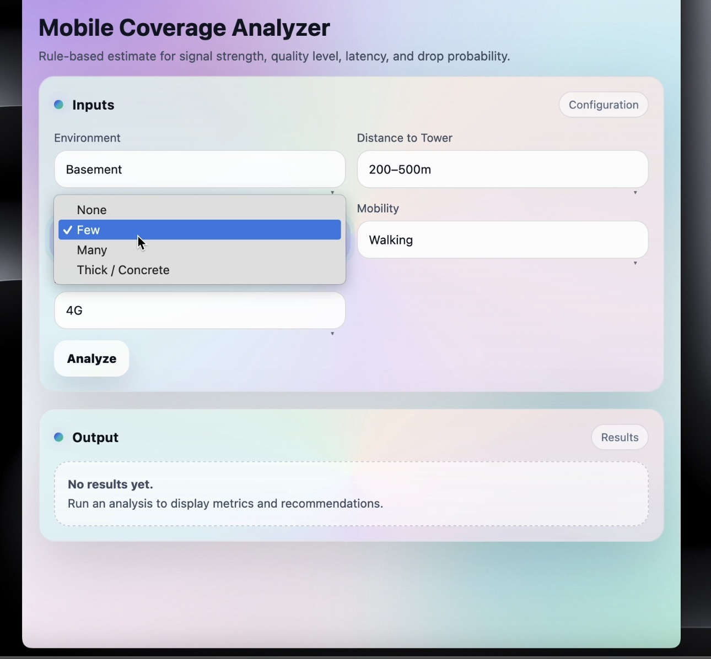

Mobile Coverage Analyzer

This project was originally created as a **university homework**.

It is a small Flask web app that gives a simple, rule-based estimate of mobile network coverage.

The app considers things we deal with every day, such as:
Location (home, street, mall, campus, etc.)
 Distance to the tower
 Walls and obstacles
 Movement
 Network type (3G / 4G / 5G / Wi-Fi)

It then shows signal quality, latency, and basic advice.

This project is for learning and demonstration purposes, not real signal measurement.


## Screenshots




##How to run the project

 1) Clone the repository
```bash
git clone https://github.com/domoa404/mobile-coverage-app.git
cd mobile-coverage-app
Install requirements

Make sure Python is installed, then run:

2)pip install -r requirements.txt

3) Run the application
python app.py

4) Open in browser

Open your browser and go to:

http://127.0.0.1:5000

